# 系统安全设计

---
**安全基础技术**

* 对称与非对称加密
* 数字签名
* 信息摘要

**网络安全**
* 安全协议
* 网络攻击
* 等级保护标准
---

# 一、对称与非对称加密

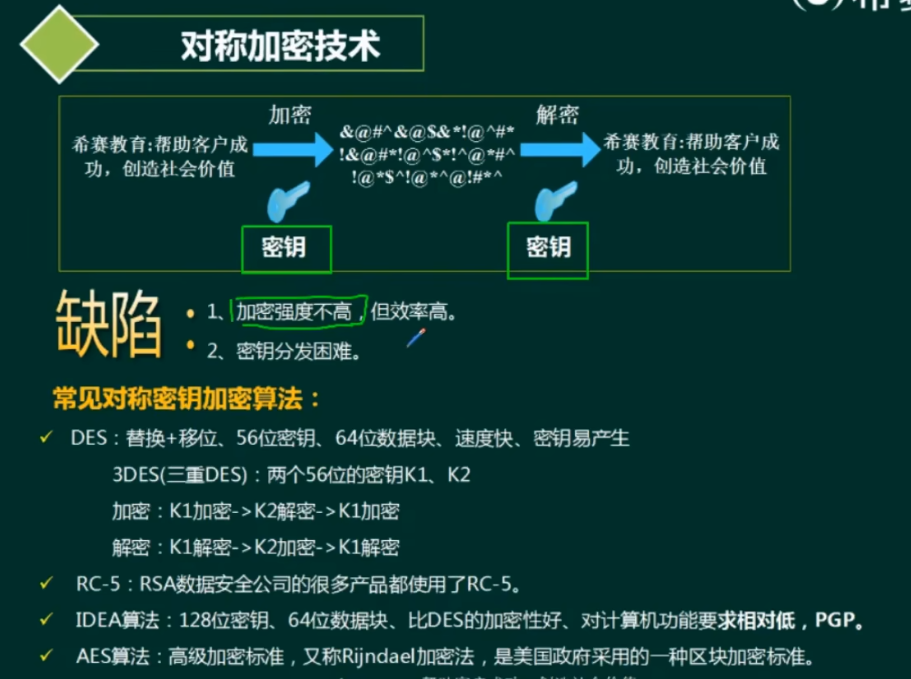

常见对称密钥加密算法:
* DES:替换+移位、|56位密钥、64位数据块、速度快、密钥易产生
    * 3DES(三重DES):两个56位的密钥K1、K2
    * 加密:K1加密->K2解密->K1加密
    * 解密:K1解密->K2加密->K1解密
* RC-5 : RSA数据安全公司的很多产品都使用了RC-5。
* IDEA算法∶128位密钥、64位数据块、比DES的加密性好、对计算机功能要求相对低，PGP。
* AES算法:高级加密标准，又称Rijndael加密法，是美国政府采用的一种区块加密标准。

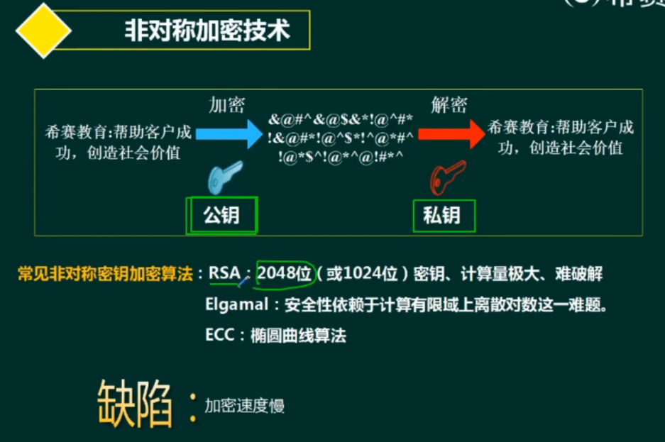

常见非对称密钥加密算法:
* RSA : 2048位(或1024位）密钥、计算量极大、难破解
* Elgamal:安全性依赖于计算有限域上离散对数这一难题。
* ECC:椭圆曲线算法

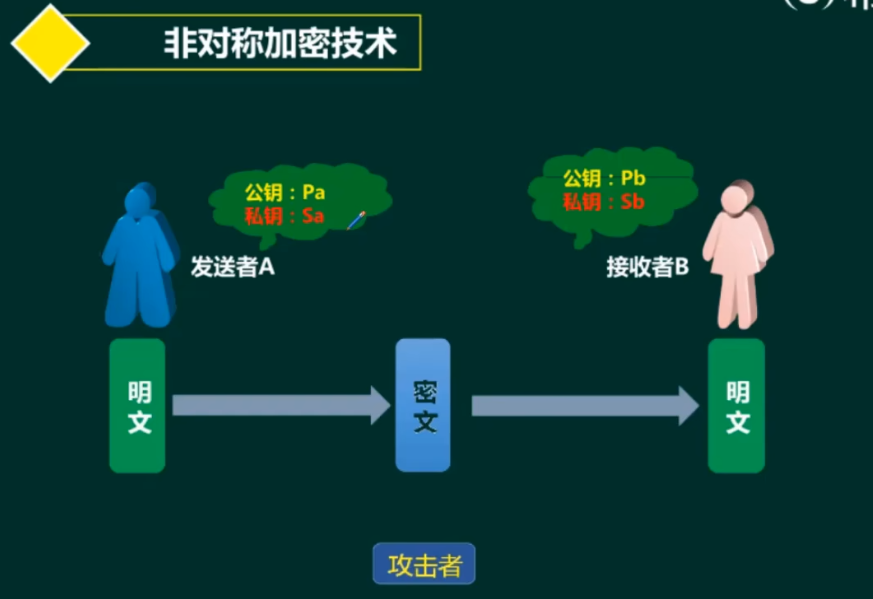

# 二、数字签名

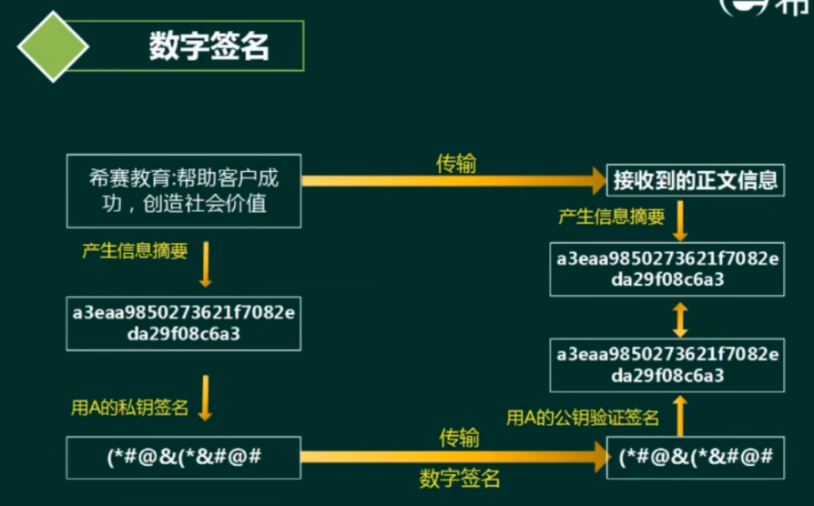

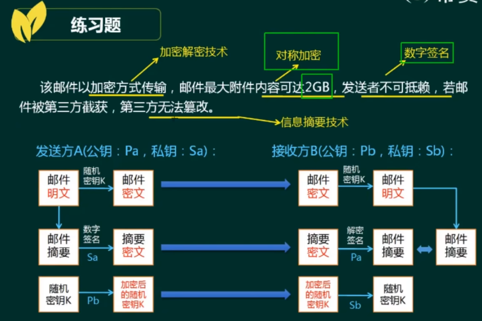

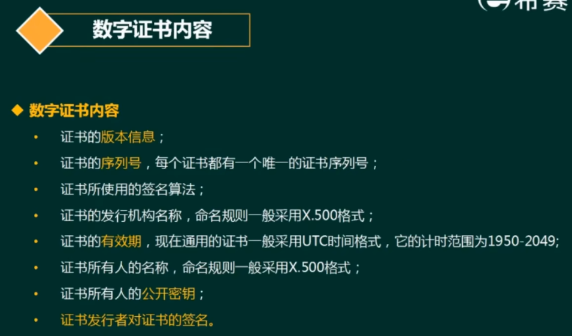

**数字证书内容**
1. 证书的**版本信息**;
2. 证书的**序列号**，每个证书都有一个唯一的证书序列号;
3. 证书所使用的签名算法;
4. 证书的发行机构名称，命名规则一般采用×.500格式;
5. 证书的**有效期**，现在通用的证书一般采用UTC时间格式，它的计时范围为1950-2049;证书所有人的名称，命名规则一般采用X.500格式;
6. 证书所有人的公开密钥;
7. **证书发行者对证书的签名**;

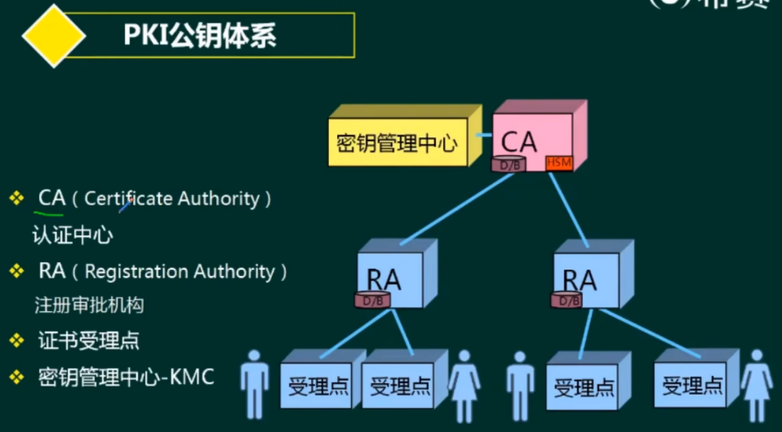

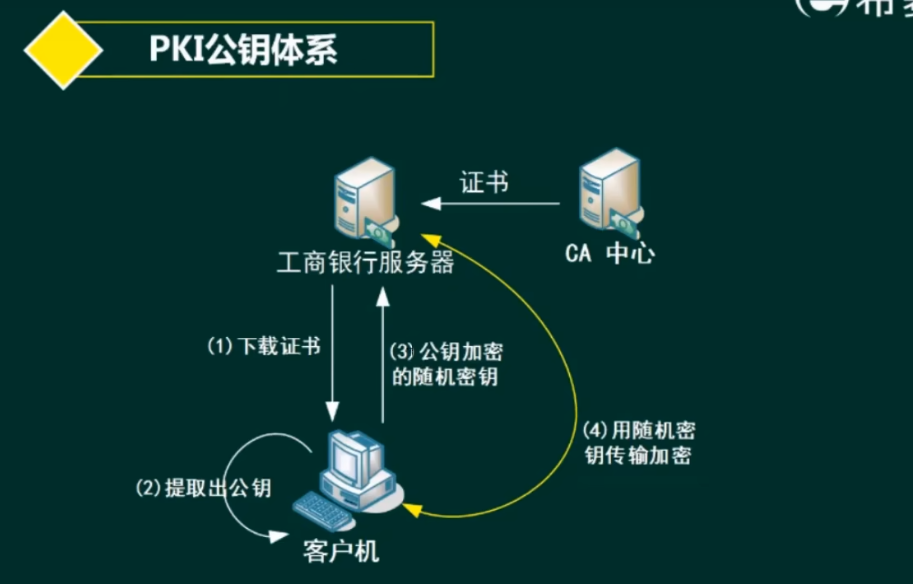

# 三、信息摘要

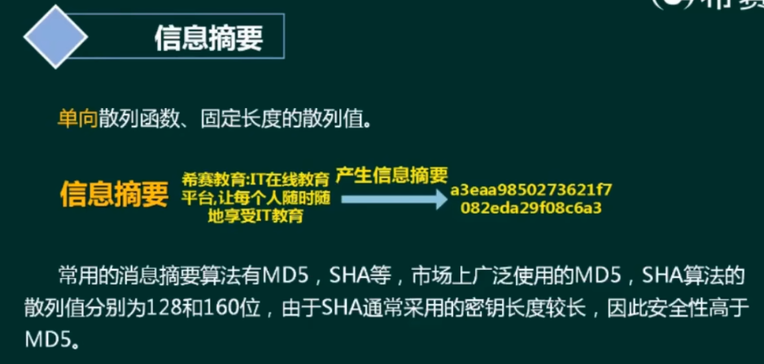

常用的消息摘要算法有MD5，SHA等，市场上广泛使用的MD5，SHA算法的散列值分别为128和160位，由于SHA通常采用的密钥长度较长，因此安全性高于MD5.

# 四、安全协议

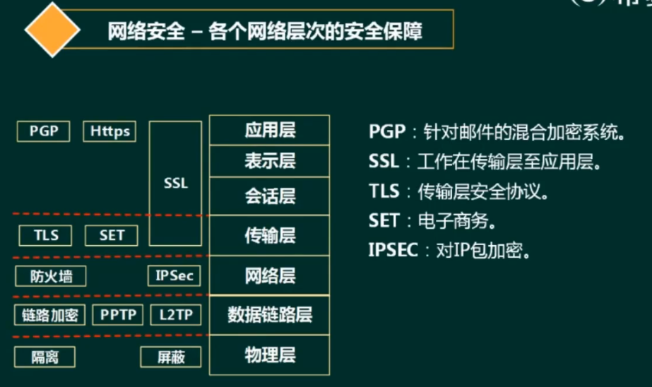

* PGP(Pretty Good Privacy):优良保密协议。
* SSL(Secure Sockets Layer):安全套接字协议。
* TLS(Transport Layer Security)∶传输层安全协议。
* SET(Secure Electronic Transaction):安全电子交易协议。
* IPSEC(Internet Protocol Security):互联网安全协议。

# 五、网络攻击

1. 被动攻击∶收集信息为主，破坏保密性。
2. 主动攻击:主动攻击的类别主要有∶中断（破坏可用性），篡改（破坏完整性），伪造（破坏真实性)。

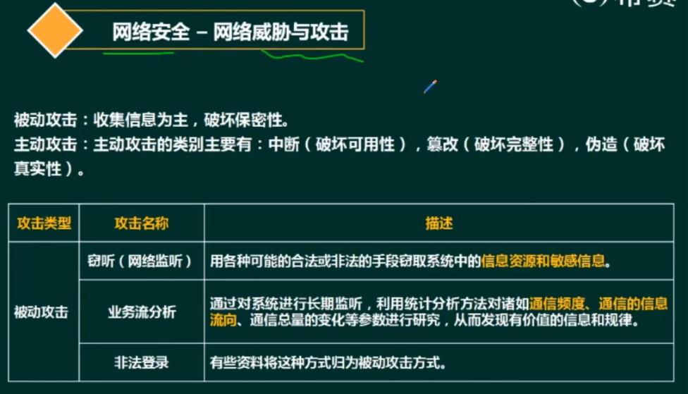

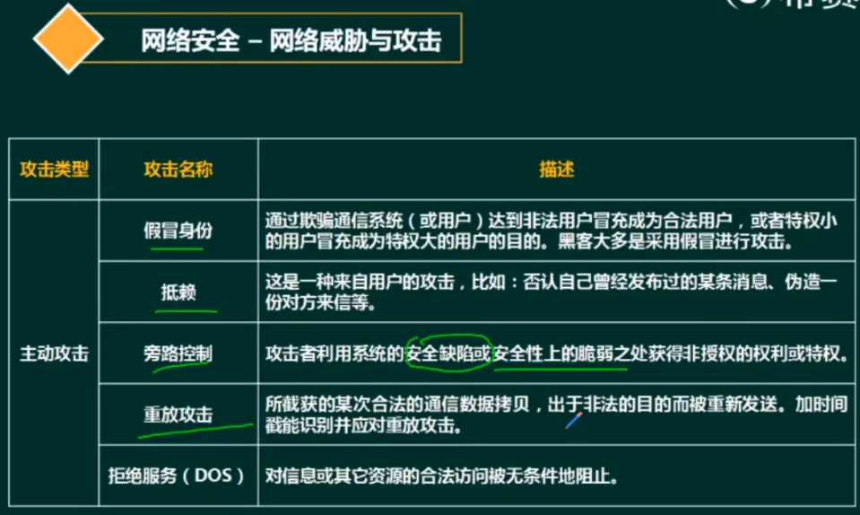

# 六、等级保护标准

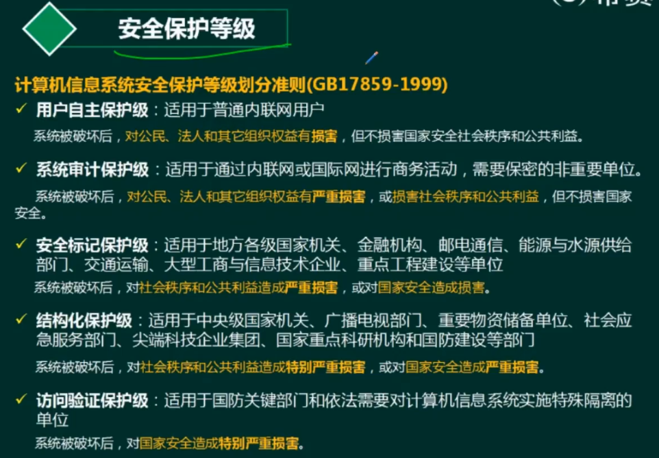

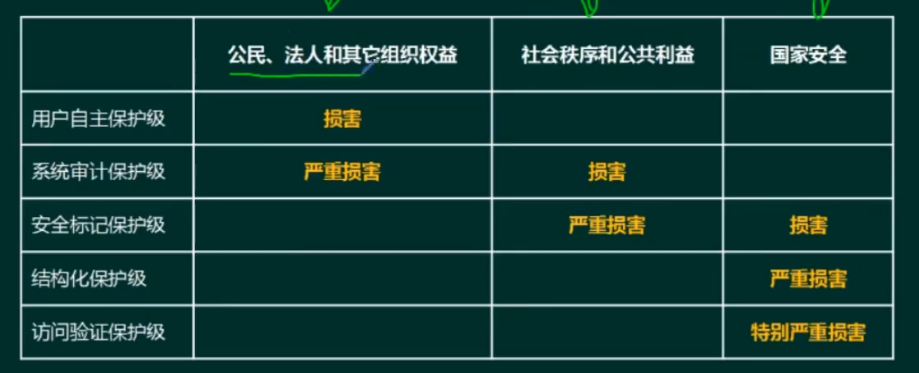

1. 用户自主保护级:适用于普通内联网用户.系统被破坏后，对公民、法人和其它组织权益有损害，但不损害国家安全社会秩序和公共利益。
2. 系统审计保护级︰适用于通过内联网或国际网进行商务活动，需要保密的非重要单位。系统被破坏后，对公民、法人和其它组织权益有严重损害，或损害社会秩序和公共利益，但不损害国家安全。
3. 安全标记保护级︰适用于地方各级国家机关、金融机构、邮电通信、能源与水源供给部门、交通运输、大型工商与信息技术企业、重点工程建设等单位.系统被破坏后，对社会秩序和公共利益造成严重损害，或对国家安全造成损害。
4. 结构化保护级︰适用于中央级国家机关、广播电视部门、重要物资储备单位、社会应急服务部门、尖端科技企业集团、国家重点科研机构和国防建设等部门.系统被破坏后，对社会秩序和公共利益造成特别严重损害，或对国家安全造成严重损害。
5. 访问验证保护级︰适用于国防关键部门和依法需要对计算机信息系统实施特殊隔离的单位.系统被破坏后，对国家安全造成特别严重损害。

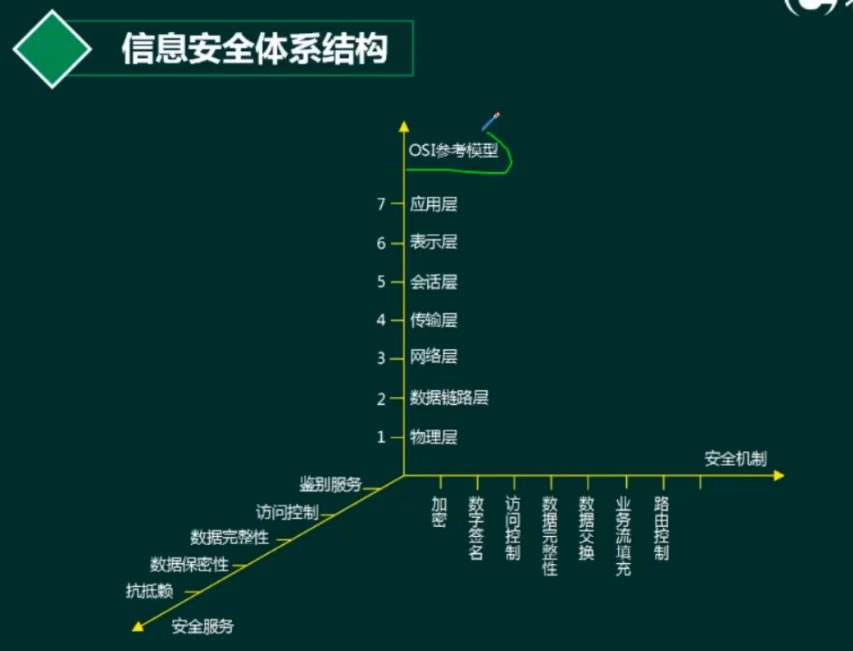

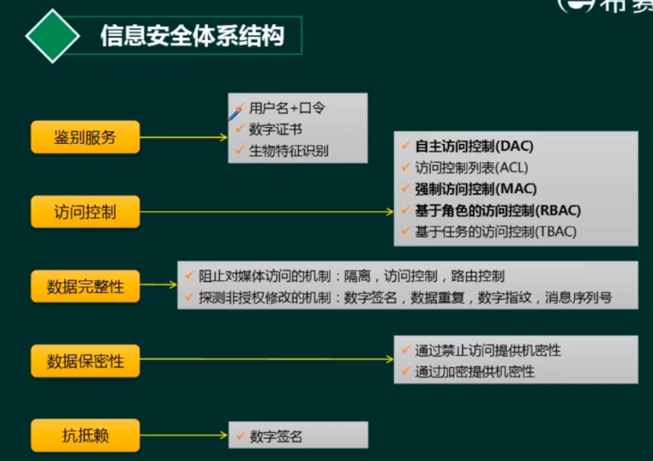