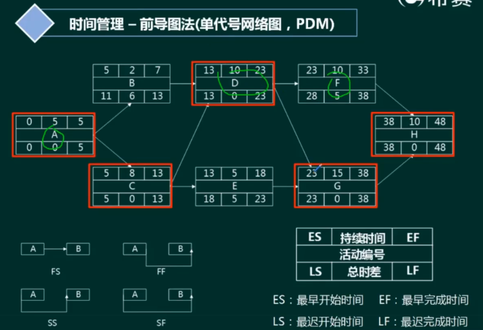
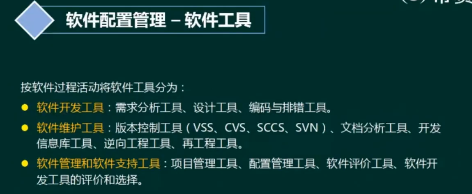

# 软件项目管理

---
* 范围管理
* 时间管理
* 成本管理
* 软件质量管理
* 软件配置管理
* 风险管理
---

# 一、范围管理

# 二、时间管理

# 三、成本管理

# 四、软件质量管理

**质量保证**：一般是每隔一定时间（例如，每个阶段末）进行的，主要通过系统的质量审计和过程分析来保证项目的质量。独特工具包括:质量审计和过程分析。

**质量控制**：实时监控项目的具体结果，以判断它们是否符合相关质量标准，制订有效方案，以消除产生质量问题的原因。

# 五、软件配置管理

# 六、风险管理

