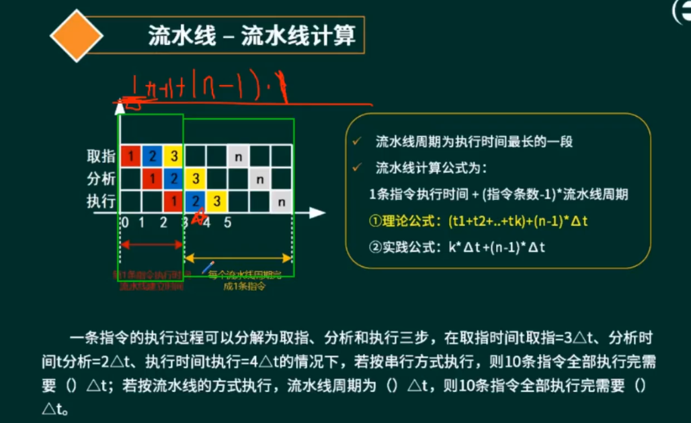
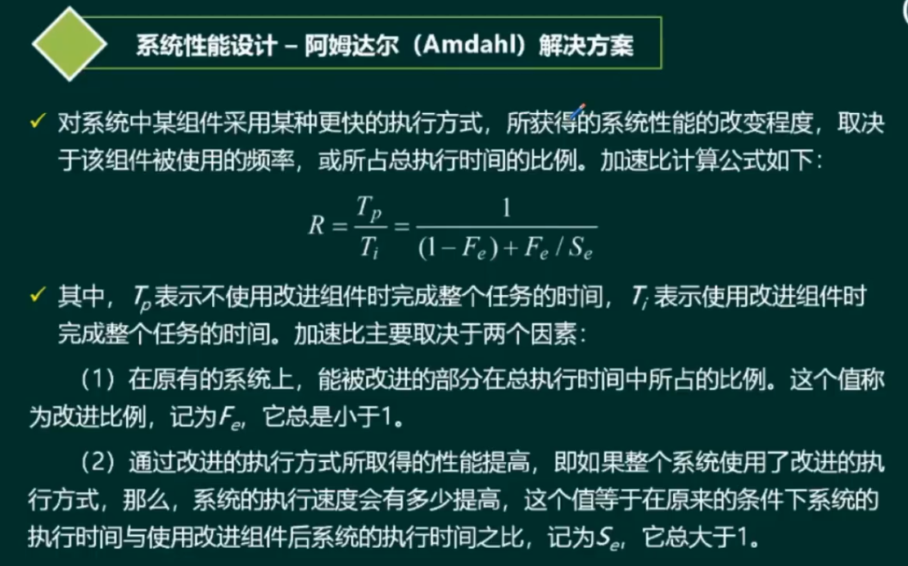

# 计算机组成原理

---
* Flynn分类法
* CISC与RISC
* 存储系统
* 流水线技术
* 校验码
* 嵌入式系统
* 系统配置与性能评价
---

# Flynn分类法

# CISC与RISC

# 存储系统

# 流水线技术

相关参数计算:**流水线执行时间计算、流水线吞吐率、流水线加速比、流水线效率**

流水线是指在程序执行时多条指令重叠进行操作的一种准并行处理实现技术。各种部件同时处理是针对不同指令而言的，
它们可同时为多条指令的不同部分进行工作，以提高各部件的利用率和指令的平均执行速度.

# 校验码

# 嵌入式系统

# 系统配置与性能评价

