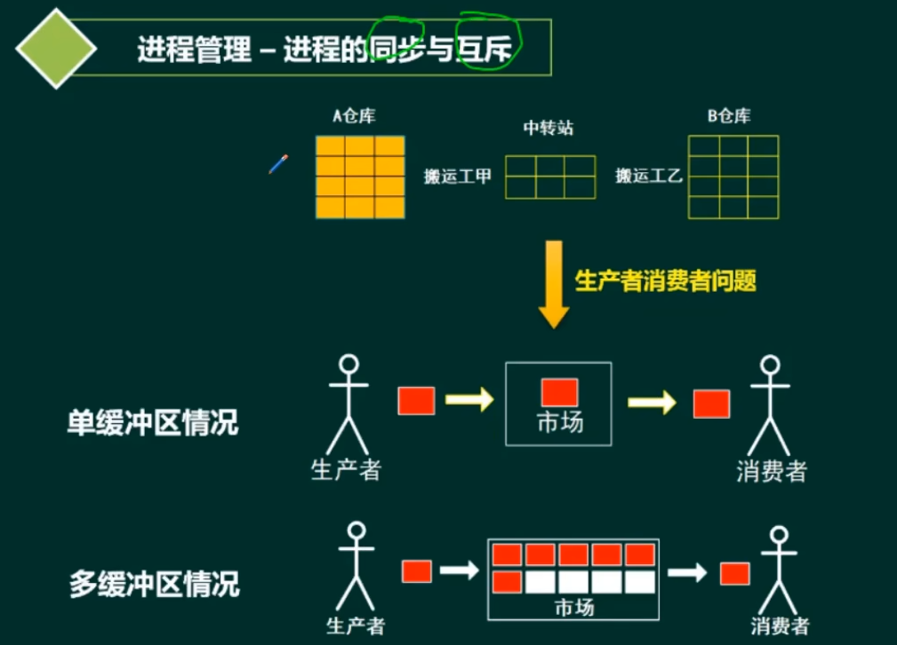
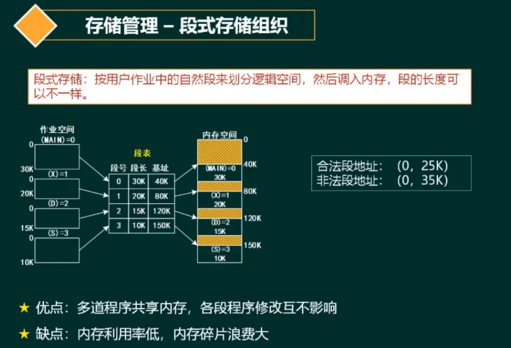

# 计算机操作系统设计

---
* 操作系统概论
* 进程管理
  * 进程状态
  * 前趋图
  * 信号量与PV操作
  * 死锁与银行家算法
* 文件管理
  * 绝对路径
  * 索引文件
  * 位图
* 作业管理
* 设备管理
* 微内核操作系统
* 嵌入式操作系统
---

# 一、操作系统概论

# 二、进程管理

# 三、文件管理

# 四、作业管理

不用考虑这个知识点。

# 五、设备管理

# 六、微内核操作系统、嵌入式操作系统

